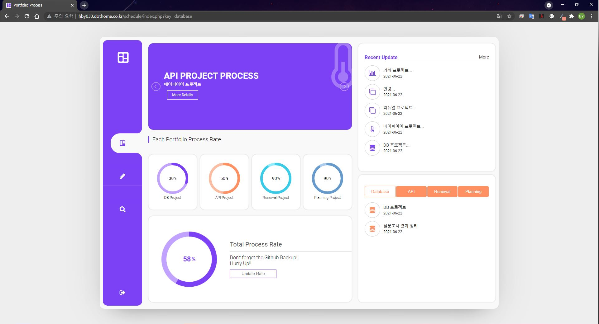
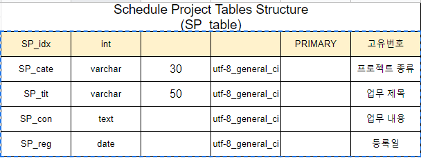
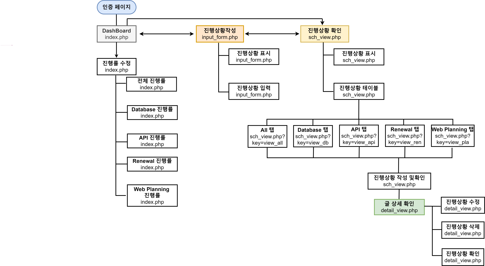

# Schedule

## Overview 😎

Database를 활용해 제작한 스케줄링 Application입니다.  그래프의 경우 pie chart plugin을 활용하여 표현하였으며 사이트에 처음 접근시 인증코드를 통해 보안기능을 추가하였습니다. 인증코드의 경우 session에 저장되어 일정 시간뒤 초기화 되는 기능을 추가하였습니다. 인증코드가 저장되는 시간을 수저하시고 싶으시면 include 폴더의 header.php에서 수정해주세요. database 구조의 경우 [아래](#data) 내용을 참고해 주세요.

인증번호 : 1q2w3e4r

호스팅 링크 : [http://hby033.dothome.co.kr/schedule/index.php](http://hby033.dothome.co.kr/schedule/index.php)

## Requirement

- HTML
- CSS
- Javascript
- [Jquery 3.6.0](https://code.jquery.com/)
- PHP
- MySQL

## Plugin

원형 차트를 구현해주는 라이브러리 plugin입니다
- pie chart plugin

## Function

- 입장 시 관리자 비밀번호(인증코드) 기능
- 세부 진행률 수정 시 전체 그래프 진행률 실시간 변경
- 진행 중 리스트 입력 기능
- 리스트 별 진행률 확인 기능
- 리스트 별 TAB 기능 구현
- 상세 리스트 수정 및 삭제 기능

## <a id="data">Database Structure Table</a>

## Browser Support

 Chrome |  Firefox |  IE/edge |  opera |  safari
--- | --- | --- | --- | --- |
Latest ✔ | Latest ✔ | No Support / 10+ ✔ | Latest ✔ | 6.1+ ✔ |
